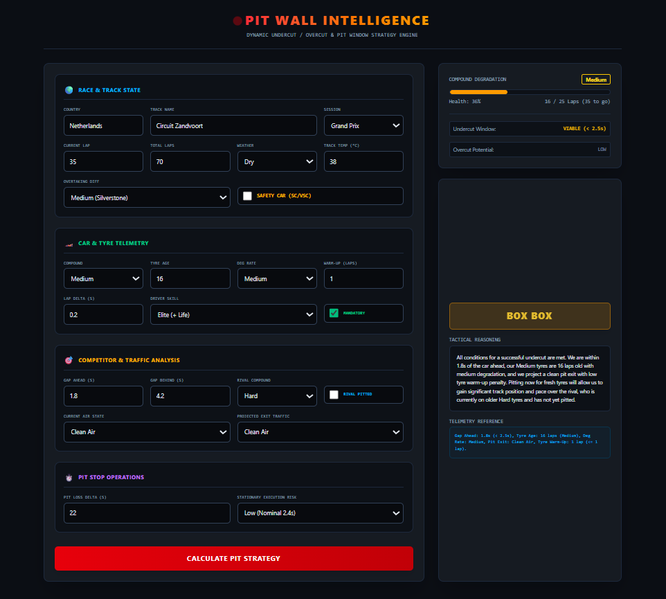

# 🏎️ Pit Wall Intelligence

> **Real-Time Strategic Inference Engine for Formula 1 Pit Operations**

---

## 🌐 Live Application

**Experience the tactical engine in action:** [Pit Wall Intelligence - Live Dashboard](https://pit-wall-ai.vercel.app/)


> ⚠️ **Note on Performance:** The Spring Boot backend is hosted on Render's free tier, which spins down after 15 minutes of inactivity. **Please allow 30–50 seconds for your first "Calculate Pit Strategy" request** as the server cold-starts. Subsequent calculations will execute in milliseconds.

---

### 📸 Dashboard Preview
<!-- Replace the link below with the actual path to your screenshot once you upload it to your repo -->



**Pit Wall Intelligence** is a full-stack tactical decision dashboard engineered to simulate and compute Formula 1 race strategies. Powered by Google's **Gemini 2.5 Flash** model with strict structured schema constraints, the application evaluates complex dynamic race parameters—including tire degradation rates, traffic dirty air, undercut/overcut windows, track temperatures, and neutralization phases (SC/VSC)—to deliver actionable pit decisions (`BOX` vs. `STAY OUT`) in milliseconds.

---

## 📸 Overview

The dashboard bridges real-world motorsport telemetry principles with cutting-edge LLM-driven inference:
- **Integrated Monorepo Architecture:** React (Vite + Tailwind CSS) client housed within a containerized Spring Boot 3 REST API repository.
- **Circuit & Session Aware:** Ingests specific circuit metadata (Zandvoort, Monaco, Monza, etc.) across various session types (Grand Prix, Sprint, Qualifying, FP1–FP3).
- **Physical-Grade Tactical Feedback:** Visual compound health bar, live undercut threat warnings, and overcut viability calculations.

---

## ⚡ Core Strategic Modeling Principles

The inference engine evaluates trade-offs across several primary pillars:

1. **Time Delta vs. Remaining Laps:** Calculates whether fresh-tire delta offset will net positive lap time before the checkered flag against pit lane stationary and traversal loss.
2. **The Undercut Mechanic:** Evaluates trailing gaps (< 2.5s), tire degradation state, warm-up lap penalties, and pit exit traffic to trigger proactive undercuts.
3. **The Overcut Mechanic:** Computes track position retention when rivals pit into dirty air while the lead car has clean air and viable remaining compound life.
4. **Thermal Degradation & Compound Cliffs:** Models compound lifespans (Soft: 15, Medium: 25, Hard: 40 laps) adjusted dynamically by track temperature (> 40°C) and driver management skill.
5. **Traffic & Track Position:** Weighting track overtaking difficulty (e.g., Monaco vs. Monza) against the risk of rejoining inside a DRS train.
6. **Neutralization Exploitation:** Optimizes pit loss under Safety Car (SC) or Virtual Safety Car (VSC) conditions when pit lane delta loss is effectively halved.
7. **FIA Sporting Regulations:** Enforces mandatory compound changes within regulatory lap limits.

---

## 🛠️ Tech Stack

### **Frontend**
- **Framework:** React 18 / 19 (via Vite)
- **Styling:** Tailwind CSS (Dark Strategy Theme)
- **Deployment:** Vercel

### **Backend**
- **Framework:** Spring Boot 3.x (Java 21)
- **Data Serialization:** Jackson `ObjectMapper`
- **HTTP Client:** Spring `RestTemplate`
- **Deployment:** Render (via Multi-Stage Docker container)

### **AI & Inference Engine**
- **Model:** Google Gemini 2.5 Flash (`gemini-2.5-flash`)
- **Integration:** Google Generative Language API
- **Response Format:** Strict JSON Schema Enforcement (`application/json`)

---

## 🏛️ System Architecture

```text
┌────────────────────────────────────────────────────────┐
│                   Client Layer (Vercel)                │
│             React + Vite + Tailwind CSS UI             │
└───────────────────────────┬────────────────────────────┘
                            │ HTTPS (POST /api/strategy)
                            ▼
┌────────────────────────────────────────────────────────┐
│               Backend Layer (Render / Docker)          │
│                Spring Boot 3 REST Controller           │
└───────────────────────────┬────────────────────────────┘
                            │ HTTPS (JSON Schema Prompt)
                            ▼
┌────────────────────────────────────────────────────────┐
│               Inference Layer (Google AI)              │
│                  Gemini 2.5 Flash Engine               │
└────────────────────────────────────────────────────────┘

```

---

## 📁 Repository Structure

```text
pit-wall-intelligence/
├── .mvn/                           # Maven Wrapper files
├── pitwall-ui/                     # React / Vite Client (Frontend)
│   ├── public/                     # Public assets
│   ├── src/                        # React source code
│   │   ├── assets/                 # Local UI assets
│   │   ├── App.jsx                 # Main application component
│   │   ├── index.css               # Tailwind styling
│   │   └── main.jsx                # React mounting point
│   ├── .env                        # Local environment variables
│   ├── .env.production             # Production environment variables
│   ├── index.html                  # Vite HTML entry point
│   ├── package.json                # Node dependencies
│   ├── tailwind.config.js          # Tailwind CSS configuration
│   └── vite.config.js              # Vite configuration
├── src/                            # Spring Boot Application (Backend)
│   ├── main/
│   │   ├── java/dev/f1/            # Java source code
│   │   │   ├── F1Application.java
│   │   │   └── PitWallController.java
│   │   └── resources/              # Backend configuration
│   │       ├── templates/
│   │       └── application.properties
│   └── test/java/dev/f1/           # Backend tests
├── Dockerfile                      # Multi-stage Docker build config
├── mvnw                            # Maven Wrapper script
└── pom.xml                         # Maven dependencies configuration

```

---

## 🚀 Local Development Setup

### **Prerequisites**

* Java 21 (JDK)
* Node.js 18+ & npm
* Maven 3.9+
* A Google Gemini API Key ([Google AI Studio](https://www.google.com/search?q=https://aistudio.google.com/))

---

### **1. Backend Setup (Spring Boot)**

The backend source code and Maven wrapper sit at the root of the project.

1. **Configure your environment variable:**
Create an environment variable named `GEMINI_API_KEY` on your machine, or add it to `src/main/resources/application.properties`:
```properties
gemini.api.key=${GEMINI_API_KEY:your_gemini_api_key_here}
server.port=${PORT:8080}

```


2. **Build and run the service from the root directory:**
```bash
./mvnw clean spring-boot:run

```


The backend will start at `http://localhost:8080`.

---

### **2. Frontend Setup (React / Vite)**

1. **Navigate to the frontend directory:**
```bash
cd pitwall-ui

```


2. **Install dependencies:**
```bash
npm install

```


3. **Configure environment files:**
* **`.env`** (for local development):
```env
VITE_API_URL=http://localhost:8080/api/strategy

```


* **`.env.production`** (for production deployment):
```env
VITE_API_URL=https://<your-render-app-name>[.onrender.com/api/strategy](https://.onrender.com/api/strategy)

```


4. **Launch development server:**
```bash
npm run dev

```


The frontend will be available at `http://localhost:5173`.

---

## 📡 API Specification

### `POST /api/strategy`

#### **Request Payload**

```json
{
  "country": "Netherlands",
  "trackName": "Circuit Zandvoort",
  "sessionType": "Grand Prix",
  "currentLap": 35,
  "totalLaps": 70,
  "weatherCondition": "Dry",
  "trackTemperature": 38.0,
  "trackOvertakingDifficulty": "Medium",
  "safetyCarDeployed": false,
  "tireCompound": "Medium",
  "tireAge": 16,
  "tyreDegradationRate": "Medium",
  "tyreWarmUpLaps": 1,
  "lapTimeDelta": 0.2,
  "driverTireManagementSkill": "Elite",
  "mandatoryCompoundFulfilled": true,
  "gapToCarAhead": 1.8,
  "gapToCarBehind": 4.2,
  "currentAirState": "Clean Air",
  "projectedPitExitTraffic": "Clean Air",
  "rivalTireCompound": "Hard",
  "rivalHasPitted": false,
  "pitLaneTimeLoss": 22.0,
  "pitStopExecutionRisk": "Low"
}

```

#### **Response Body (Strict Schema Enforcement)**

```json
{
  "decision": "Box",
  "reasoning": "Rival ahead is within undercut range (1.8s) and projected exit traffic is Clean Air. With current Medium tires at 16 laps entering thermal degradation and warm-up latency at 1 lap, executing an undercut now guarantees net track position advantage.",
  "foundryCitation": "Undercut Delta Model v4.2; Pit Loss Delta 22.0s offset by estimated 1.8s/lap pace advantage."
}

```

---

## 🗺️ Future Roadmap

* [ ] Integration with historical OpenF1 API telemetry archives.
* [ ] Multi-car strategy simulations (Driver A vs. Driver B split strategies).
* [ ] Dynamic weather radar forecasts and rain intensity progression.
* [ ] Exportable post-race telemetry debrief reports (PDF/Markdown).

---

## 📄 License

This project is open-source and distributed under the [MIT License](https://www.google.com/search?q=LICENSE).
